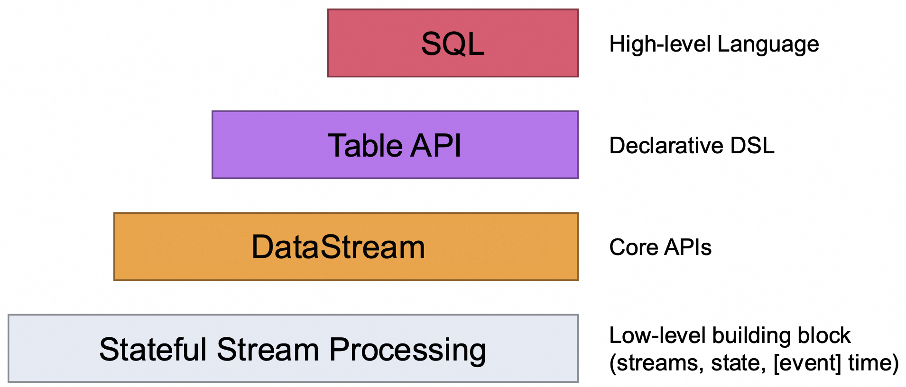

# Flink`s APIs 
개발자는 Flink에서 제공하는 추상화 API를 사용하여 쉽게 애플리케이션을 개발할 수 있습니다.  
Flink는 추상화 수준에 따라 4가지 API를 제공합니다.  
  

- Stateful Stream Processing
  - 가장 낮은 수준의 추상화로써 단순히 상태 저장 및 스트림 처리를 위한 설정을 제공합니다.
  - 상태 관린, 이벤트 시간 처리, 윈도우 연산, 저장소 백엔드 관리 기능
- DataStream
  - Core API로써 다양한 작업(transformations, Join, Window, state, ...)을 할 수 있습니다.
- Table API
  - 데이터프레임과 같은 테이블 형태에서 다양한 작업들을 할 수 있습니다.
  - DataStream과 Table을 혼합하여 사용할 수 있습니다.
- SQL
  - 가장 높은 수준의 추상화로써 SQL 쿼리를 실행할 수 있습니다.
  - Table API에서 실행합니다.