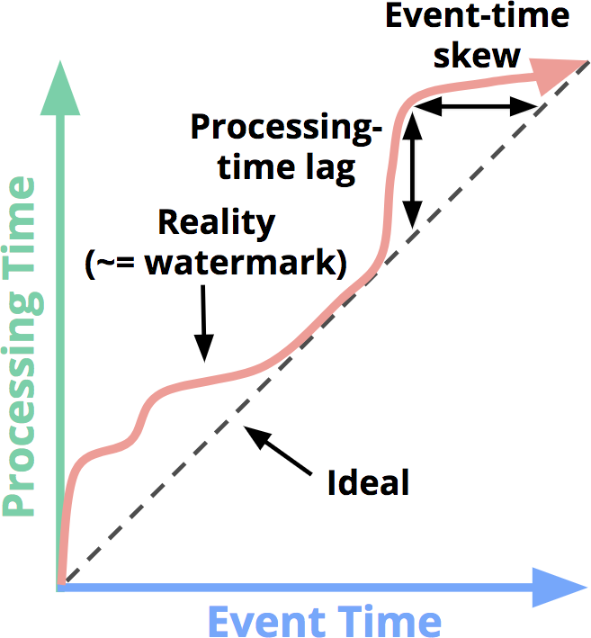
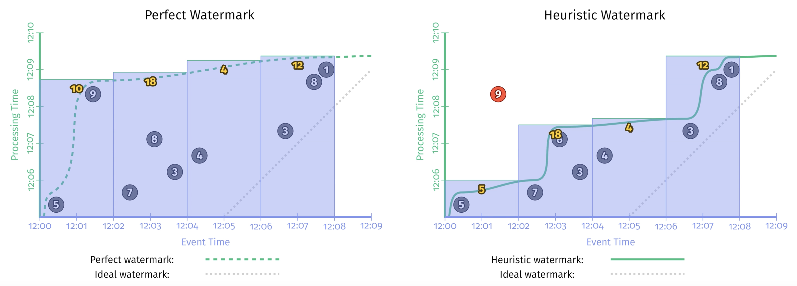

## What
Streaming 처리에서 What에 해당되는 부분은 무엇을 처리할지 즉, "무슨 결과가 계산되는가?"라는 질문에 답
즉 데이터를 합계할 것인지?, 집계할 것인지? 등등과 같은 작업을 의미
배치처리도 What에 대한 부분은 동일  
- pseudo code(Apache Beam)
```
PCollection<String> rwa = IO.read(...);
PCollection<KV<Team, Integer>> input = raw.apply(new ParseFn())
PCollection<KV<Team, Integer>> totals =
    input.apply(Sum.integerPerKey());
```  
  
## Where
Where에 해당되는 부분은 윈도우(Winodw)  
Window는 데이터 소스에서 시간 경계를 따라 자르는 작업  
종류는 Fixed(tumbling), Sliding, Session이 있음  
- Fixed Window pseudo code(Apache Beam)
```
PCollection<String> rwa = IO.read(...);
PCollection<KV<Team, Integer>> input = raw.apply(new ParseFn())
PCollection<KV<Team, Integer>> totals =
    input
        .apply(Window.into(FixedWindows.of(TWO_MINUTES)))
        .apply(Sum.integerPerKey());
```  
  
## When
When에 해당되는 부분은 트리거(Trigger)와 워터마크(Watermark)  
### 1. 트리거(Tigger)
트리거는 결과를 언제 구체화하는지에 대한 답  
윈도우 별로 각 출력을 패널이라고 함  
[트리거 종류]   
- 반복 업데이트 트리거(repeated update trigger)
  - 일정한 주기로 패널 생성
  - 데이터가 들어 올 시(매 레코드 마다), 1분 당 패널 생성 등
  - 구체화 뷰
- 완료 트리거(completeness trigger)
  - 입력이 완료 됐다고 믿는 시점에 패널 생성
  - 누락 혹은 지연된 데이터도 처리 가능  
  
- 매 레코드 마다(데이터 단위) 트리거 
  - pseudo code(Apache Beam)
    ```
    PCollection<KV<Team, Integer>> totals =
        input
            .apply(Window.into(FixedWindows.of(TWO_MINUTES))
                        .triggering(Repeatedly(AtterCount(1))));
            .apply(Sum.integerPerKey());
    ```  
  - 장점
    - 가장 최근 결과 업데이트 값을 볼 수 있음
    - 시간에 지남에 따라 최종 결과에 수렴
  - 단점
    - 결과가 자주 생성  
  
- 처리 시간 지연 트리거
매 레코드마다 트리거 시 결과가 너무 자주 생성되는 문제가 있기 때문에 초, 분 단위로 업데이트하여 단점을 보완  
처리 시간 지연 트리거는 2가지가 있음.  
1. 정렬 지연(aligned delay)  
윈도우 전체가 고정된 지연  
장점은 수정이 필요한 모든 윈도우에 정기적인 업데이트  
단점은 모든 윈도우를 업데이트하니 부하가 발생
- pseudo code(Apache Beam)
```
    PCollection<KV<Team, Integer>> totals =
        input
            .apply(Window.into(FixedWindows.of(TWO_MINUTES))
                        .triggering(Repeatedly(AlignedDelay(TWO_MINTUTES))));
            .apply(Sum.integerPerKey());
```    
  
1. 비정렬 지연(unaligned delay)  
정렬 지연의 부하가 발생하는 문제를 보완하기 위해 비정렬 지연 사용  
시스템 부하를 분산시키기 때문에 대규모 처리에 좋음  
윈도우의 데이터 기준으로 지연  
최종 평균치는 정렬 지연과 동일    
- pseudo code(Apache Beam)
```
    PCollection<KV<Team, Integer>> totals =
        input
            .apply(Window.into(FixedWindows.of(TWO_MINUTES))
                        .triggering(Repeatedly(UnalignedDelay(TWO_MINTUTES))));
            .apply(Sum.integerPerKey());
```  
  
반복 업데이트 트리거는 결과의 정확성이 언제 달성되는지 기준이 없음  
입력 완결성에 대한 추정이 아닌 추론을 위해 워터마크 개념이 필요  

### 2. 워터마크(Watermark)
워터마크는 언제 구체화하면 좋을지에 대한 보조 역할을 한다.  
이벤트 시간에서 입력 완결성을 제공  
  
F(P) -> E로 이해할 수 있음 즉, 처리 시간을 이벤트 시간으로 변환  
- 워터 마크 종류
  - 완벽한 워터마크(prefect watermakr) : 데이터를 완벽하게 이해 했다고 가정과 데이터가 지연이 발생하지 않는 경우 사용
  - 휴리스틱 워터마크(heuristic watermark) : 정보를 고려해 최대한 추정, 지연돠는 데이터가 발생할 수 있음  
- pseudo code(Apache Beam)
```
PCollection<KV<Team, Integer>> totals =i nput
    .apply(Window.into(FixedWindows.of(TWO_MINUTES))
                .triggering(AfterWatermark()))
    .apply(Sum.integerPerKey());
```  
  
완벽한 워터마크(좌측), 휴리스틱 워터마크(우측) 비교해보면 휴리스틱은 9 값이 출력 지연 발생  
  
워터마크의 단점은 휴리스틱 워터마크에서 데이터 지연이 워터마크 설정 시간보다 커 지연되는 경우 출력 결과가 틀릴 수 있다.  
워터마크 설정 범위가 중요  
  
## 조기/정시/지연 트리거(early/on-time/late)
반복 업데이트 트리거와 워터마크 트리거를 결합하여 사용하는 방식  
패널을 조시/정시/지연 세 종류로 나눔  
- 조기 트리거
  - 윈도우가 닫히기 전에 미리 출력하는 트리거
  - 빠른 피드백 가능
  - 예) 이벤트가 일정 개수 도달할 때 부분 결과 출력, 특정 시간 간격 부분 집계 출력
- 정시 트리거
  - 윈도우가 닫히는 시점에 정확하게 실행되는 트리거
  - 예) 지정된 윈도우가 끝나면 집계 출력
- 지연 트리거
  - 윈도우가 닫힌 후, 지연된 데이터가 있을 때 다시 실행되는 트리거
  - 허용된 시간(가비지 컬렉션)까지만 실행
  
## How
How에 해당되는 부분은 누적  
윈도우에서 패널간의 관계가 어떻게 되는가에 대한 답  
총 3가지 모드가 있음
- 무시(discarding) : 이전 패널 값을 무시하고 독립적인 방식
- 누적(acumulating) : 이전 패널 값에 누적하는 방식
- 누적 및 철회(accumulating and retracting) : 이전 패널에 누적과 함께 이전 패널(철회) 정보도 제공  

||무시|누적|누적 및 철회|
|------|---|---|---|
|Pane 1 : inputs=[3]|3|3|3|
|Pane 1 : inputs=[8, 1]|9|12|12, -3|
|Value of final normal pane|9|12|12|
|Sum of all panes|12|15|1232|

