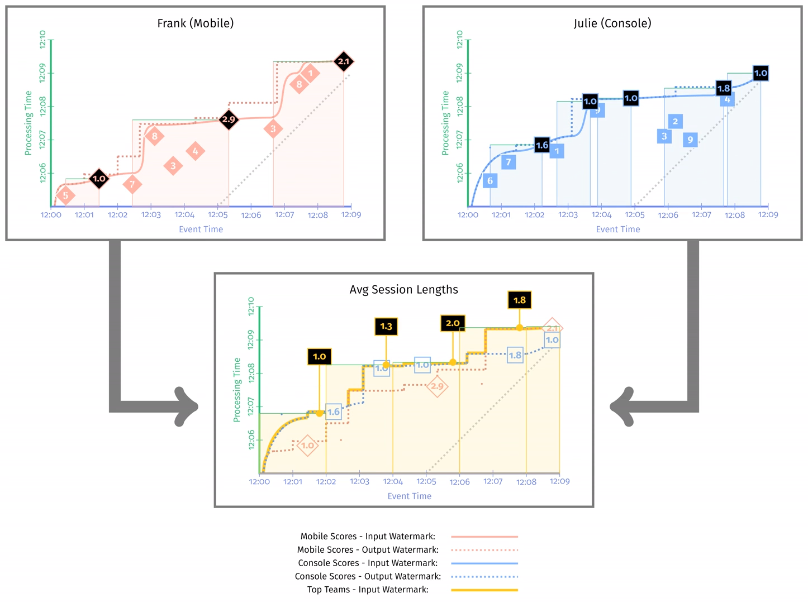
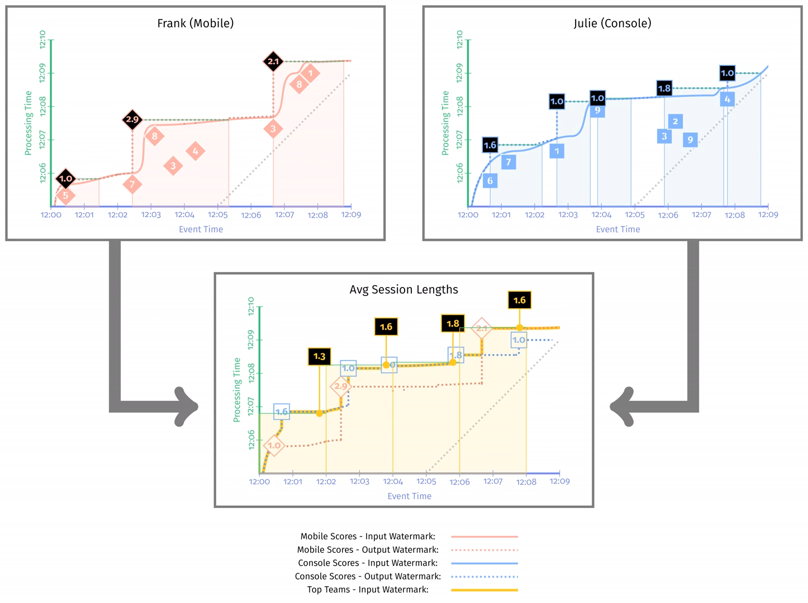
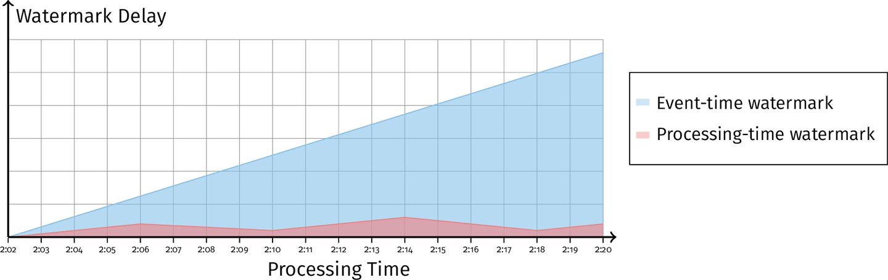
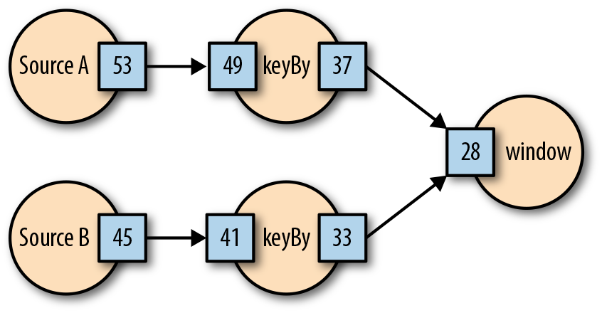

Watermark는 데이터 완결성과 관련된 기능이다.  
만약 윈도우 내에 지연이 발생한 데이터가 있으면 어떻게 처리할지에 대한 고민, 즉 완결성과 관련된 문제  
Watermark에는 2가지 유형이 있다.  
1. 완벽한(perfect) 워터마크
2. 휴리스틱(heuristic) 워터마크
완벽한 워터마크는 들어오는 데이터에 대해 완벽하게 알고 있다는 가정하에 절대 지연되는 데이터가 없다고 생각하는 것이다.  
만약 처리하는 데이터 방식이 이벤트 시간이 아닌 처리 시간 기준으로 처리한다면 완벽한 워터마크를 사용하는 방식과 유사하다  
그게 아닌 이벤트 시간으로 지연이 없다는 가정은 현실적으로 불가능하기 때문에 불가능한 방식의 워터마크  
  
반면에 휴리스틱 워터마크는 지연을 인정하고 지연 데이터를 거의 발생시키지 않게 구성하기 위한 방식이다.  
소스 데이터에 대한 파악을 잘할 수록 휴리스틱이 향상되고 결국 더 적은 지연 데이터를 발생시킨다.  
  
## 워터마크 전파
워터마크도 단게에 따라서 전파가 된다.  
전파에는 2가지 단계가 있다.  
1. 입력(input) 워터마크 : 특정 연산의 입력으로 들어오는 워터마크  
입력 스트림에서 가장 낮은 워터마크 값이 연산의 입력 워터마크가 된다.  
ex)  
스트림 A의 워터마크: 2025-03-15T12:00:00  
스트림 B의 워터마크: 2025-03-15T12:02:00  
조인 연산의 입력 워터마크: 2025-03-15T12:00:00  
2. 출력(output) 워터마크 : 연산 결과와 함께 전달되는 워터마크  
이벤트 시간 중 최솟값이 출력 워터마크가 된다.  
  
입출력 워터마크를 정의하면 좋은 점은 이벤트 시간의 지연을 계산할 수 있다.  
출력 워터마크 - 입력워터마크의 결과는 해당 단계의 지연 시간이다.  
  
예를 들어 세션 윈도우를 사용한 2개의 결과를 고정 윈도우를 통해 평균 세션을 구하려고한다.  
- Code
```
PCollection<Double> mobileSessions = IO.read(new MoblieInputSource())
    .apply(Window.into(Session.withGapDuration(Duration.stanardMinutes(1)))
                 .triggering(AtWatermark())
                 .discardingFiredPanes())
    .apply(CalculateWindowLength())

PCollection<Double> consoleSessions = IO.read(new MoblieInputSource())
    .apply(Window.into(Session.withGapDuration(Duration.stanardMinutes(1)))
                 .triggering(AtWatermark())
                 .discardingFiredPanes())
    .apply(CalculateWindowLength())

PCollection<Double> averageSession = PCollectionList
    .of(mobileSessions).and(consoleSessions)
    .apply(Flatten.pCollections())
    .apply(Window.into(FixedWindows.of(Duration.standardMinutes(2)))
        .triggering(AtWatermark())
    .apply(Mean.globally())
```
코드를 보면 `mobileSessions`과 `consoleSessions`에 Session Window를 사용하여 Session의 길이를 구한다. 이 때 기본 트리거(AtWatermark), 기본 누적 모드(discardingFiredPanes)를 사용한다.  
  
여기서 출력 워터마크는 2개의 입력 워터마크 중 최소가 된다.  
  
## 워터마크 전파와 출력 타임 스탬프
워터마크 전파에서 출력 타임 스탬프 선택에 따라서 결과가 달라질 수 있다.  
출력 타임 스탬프를 윈도우에서 가장 빠른 타임 스탬프를 사용하는 경우 다음과 같이 된다.  
```
PCollection<Double> mobileSessions = IO.read(new MoblieInputSource())
    .apply(Window.into(Session.withGapDuration(Duration.stanardMinutes(1)))
                 .triggering(AtWatermark())
                 .withTimestampCombiner(EARLIST)
                 .discardingFiredPanes())
    .apply(CalculateWindowLength())

PCollection<Double> consoleSessions = IO.read(new MoblieInputSource())
    .apply(Window.into(Session.withGapDuration(Duration.stanardMinutes(1)))
                 .triggering(AtWatermark())
                 .withTimestampCombiner(EARLIST)
                 .discardingFiredPanes())
    .apply(CalculateWindowLength())

PCollection<Double> averageSession = PCollectionList
    .of(mobileSessions).and(consoleSessions)
    .apply(Flatten.pCollections())
    .apply(Window.into(FixedWindows.of(Duration.standardMinutes(2)))
        .triggering(AtWatermark())
    .apply(Mean.globally())
```  
  
입력이 완료 될 때 출력 타임 스탬프가 생성되지 않기 때문에 빠르게 진행된다.  
출력 타임 스탬프에 따라 결과가 달라질 수 있다.  
  
## 처리시간 워터마크
이벤트 시간의 워터마크를 가지고는 데이터가 늦게 들어오는 것인지 시스템에서 처리하는 시간이 오래걸려 지연되는건지 파악할 수 없다.  
이럴 때 처리시간 워터마크를 통해 지연의 원인을 찾을 수 있다.  
아래 이미지와 같이 이벤트 시간의 워터 마크는 지연되지만 처리 시간 워터마크는 지연이 없는 경우 데이터 버퍼링(윈도우 안에 집계로 인한)으로 인한 지연일 수 있다.  
  
처리 시간 워터마크는 시스템 지연과 데이터 지연을 구분할 때 유용하다.  
  
### Flink의 Watermark
플링크는 Dataflow와 달리 중앙 집중식 워터마크 취합 방식이 아닌 데이터와 같은 흐름 내에서 추적하고 취합한다  
  
플링크는 데이터와 함께 전송되는 `워터마크 체크포인트`와 함께 전송된다.  
이 체크포인트의 의미는 해당 체크포인트보다 낮은 시간의 비지연 데이터가 발생하지 않음을 보장한다는 의미다.  
  
Flink는 중앙 집중식 워터마크를 사용하지 않기 때문에 워터마크 지연을 낮출 수 있고 확장성이 뛰어나다.  
