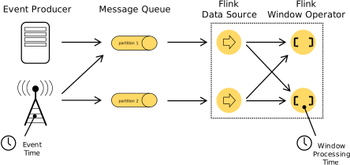
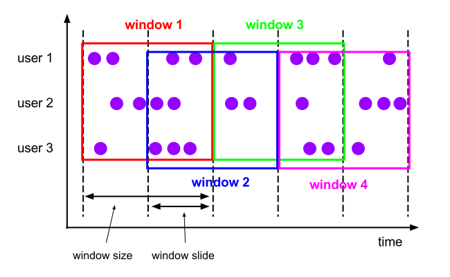
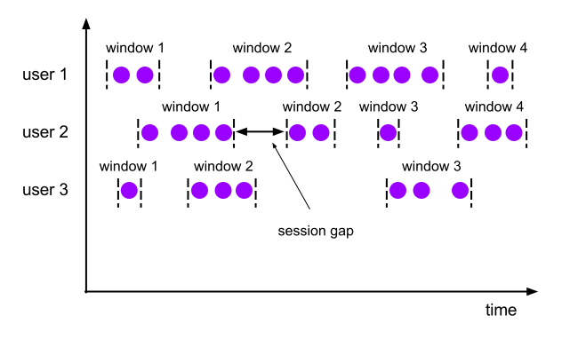

### 개요
Apache Flink를 사용하여 실시간 데이터를 처리할 때 시간(Window)을 기준으로 집계하여 데이터를 처리합니다.  
이 때 시간의 종류에는 어떤 것이 있는지와 의미를 알아보도록 하겠습니다.  
  
### Prosessing Time and Event Time
- Processing Time(처리 시간) : Apache Flink가 Data를 처리하는 시간 입니다.
- Event Time(이벤트 시간) : 이벤트 데이터에 존재하는 시간입니다.
  
Event Time은 원천 시스템(ex. 센서, 웹로그 등등)에서 생성된 시간입니다. 데이터에 이벤트 발생 시간을 표시하는 creation_date와 같은 컬림을  기준으로 처리하는 것을 의미합니다.  
  
Processing Time은 원천 시스템에서 발생한 데이터를 큐에 저장한 데이터를 읽고 Flink 처리하는 시스템의 시간입니다.  
```
env.set_stream_time_characteristic(TimeCharacteristic.ProcessingTime)
env.set_stream_time_characteristic(TimeCharacteristic.EventTime)
```  
  
### Watermark
Processing Time은 Flink 시스템의 시간대로 처리하기 때문에 데이터 도착시간에 관계 없이 즉시 처리하면 됩니다.  
하지만 Event Time 처리 방식은 데이터의 실제 발생한 기준으로 처리하기 때문에 지연된 데이터 처리를 어떻게할 것인지 고민해봐야 됩니다.  
이 때 사용하는 것이 Watermark입니다.  
  
Watermark는 이 시점까지 데이터가 도착한다고 간주하는 기준을 정하는 것 입니다.  
예를 들어 내가 Watermark를 5초로 설정하면 window 범위에서 5초 이내로만 들어오면 지연된 데이터를 처리하겠다라는 의미입니다.  
이벤트의 watermark 값이 특정 윈도우의 종료 시각을 초과할 때 윈도우를 닫고 결과를 출력합니다.  

예시 데이터를 통해 어떻게 watermark와 window가 동작되는지 보겠습니다.  
|순서|이벤트|Watermark(t3 - 3초)|
|------|---|---|
|1|1000ms|-2000ms|
|2|4000ms|1000ms|
|3|3000ms|1000ms|
|4|2000ms|1000ms|
|5|5000ms|2000ms|
|6|7000ms|4000ms|
|7|10000ms|7000ms|
- Window : 5초
- Watermark : 3초 (ts - INTERVAL '3' SECOND)
1. 처음 스트림 데이터(1000ms) 수신
- Watermark = -2000ms(1000 - 3000)
- 윈도우 [0, 5000ms)는 유지(Watermark가 5000ms를 초과하지 않음)
2. 두 번째 스트림 데이터(4000ms) 수신
- Wateramrk = 1000ms(4000 - 3000)
- [0, 5000ms)는 유지(Watermark가 5000ms를 초과하지 않음)
3. 세 번째 스트림 데이터(3000ms) 수신
- Watermark = 1000ms(유지)
- [0, 5000ms)는 유지(Watermark가 5000ms를 초과하지 않음)
이 때 Watermark의 값은 1000ms - 3000ms의 값인 -2000ms이 아니라 이전 값이랑 동일한 1000ms인 이유는 Watermark는 이전까지 받은 데이터 중 "최대 이벤트 타임"을 기준으로 계산되기 때문입니다.  
즉, Watermark 값은 감소하지 않으며, 오직 증가만합니다.  
4. 네 번째 스트림 데이터(2000ms) 수신
- Watermark = 1000ms(유지)
- [0, 5000ms)는 유지(Watermark가 5000ms를 초과하지 않음)
5. 다섯 번째 스트림 데이터(5000ms) 수신
- Wateramrk = 2000ms(5000 - 3000)
- [0, 5000ms)는 유지(Watermark가 5000ms를 초과하지 않음)
6. 여섯 번째 스트림 데이터(7000ms) 수신
- Wateramrk = 4000ms(7000 - 3000)
- [0, 5000ms)는 유지(Watermark가 5000ms를 초과하지 않음)
7. 일곱 번째 스트림 데이터(10000ms) 수신
- Wateramrk = 7000ms(10000 - 3000)
- 이제 Watermark(7000ms) >= 윈도우 종료 시간(5000ms)이기 때문에 윈도우 [0, 5000ms) 닫힘 & 결과 출력
  
### Window Assigner
Window Assinger는 스트림 데이터를 어떻게 묶어서 처리할지 정하는 방법입니다.  
종류는 크게 3가지가 있습니다.  
1. Tumbling Window
2. Sliding Window
3. Session Window
  
### Tumbling Window
Tumbling Window는 고정된 크기를 가지며 겹치지 않는 시간 안에서 이벤트를 묶어서 처리합니다.  
  
다음과 같이 코드를 작성할 수 있습니다.  
  
```
from pyflink.common.time import Instant
from pyflink.common import Types
from pyflink.table import StreamTableEnvironment, DataTypes, TableDescriptor, Schema
from pyflink.datastream import StreamExecutionEnvironment
from pyflink.table.expressions import lit, col
from pyflink.table.window import Tumble

env = StreamExecutionEnvironment.get_execution_environment()
env.set_parallelism(1)
t_env = StreamTableEnvironment.create(stream_execution_environment=env)

ds = env.from_collection(
    collection = [
        (Instant.of_epoch_milli(1000), "Alice", 110.1),
        (Instant.of_epoch_milli(4000), "Bob", 30.2),
        (Instant.of_epoch_milli(3000), "Alice", 20.0),
        (Instant.of_epoch_milli(2000), "Bob", 53.1),
        (Instant.of_epoch_milli(5000), "Alice", 13.1),
        (Instant.of_epoch_milli(3000), "Bob", 3.1),
        (Instant.of_epoch_milli(7000), "Bob", 16.1),
        (Instant.of_epoch_milli(10000), "Alice", 20.1)
    ],
    type_info = Types.ROW([Types.INSTANT(), Types.STRING(), Types.FLOAT()]))

table = t_env.from_data_stream(
    ds,
    Schema.new_builder()
          .column_by_expression("ts", "CAST(f0 AS TIMESTAMP(3))")
          .column("f1", DataTypes.STRING())
          .column("f2", DataTypes.FLOAT())
          .watermark("ts", "ts - INTERVAL '3' SECOND")
          .build()
).alias("ts", "name", "price")

# create sink
t_env.create_temporary_table(
    "sink",
    TableDescriptor.for_connector("print")
                   .schema(Schema.new_builder()
                           .column("name", DataTypes.STRING())
                           .column("total_price", DataTypes.FLOAT())
                           .column("w_start", DataTypes.TIMESTAMP(3))
                           .column("w_end", DataTypes.TIMESTAMP(3))
                           .build()).build())

table = table.window(Tumble.over(lit(5).seconds).on(col("ts")).alias("w"))\
             .group_by(col("name"), col("w"))\
             .select(col("name"), col("price").sum, col("w").start, col("w").end)

table.execute_insert("sink").wait()
```  
```
+I[Alice, 130.1, 1970-01-01T09:00, 1970-01-01T09:00:05]
+I[Bob, 86.4, 1970-01-01T09:00, 1970-01-01T09:00:05]
+I[Bob, 16.1, 1970-01-01T09:00:05, 1970-01-01T09:00:10]
+I[Alice, 13.1, 1970-01-01T09:00:05, 1970-01-01T09:00:10]
+I[Alice, 20.1, 1970-01-01T09:00:10, 1970-01-01T09:00:15]
```  
  
### Sliding Window
Sliding Window는 Tumbling Window와 달리 이전 window가 겹치면서 이전 window의 이벤트 데이터도 처리하는 방식입니다.  
  
다음과 같이 코드를 작성할 수 있습니다.  
```
from pyflink.common.time import Instant
from pyflink.common import Types
from pyflink.datastream import StreamExecutionEnvironment
from pyflink.table import StreamTableEnvironment, DataTypes, TableDescriptor, Schema
from pyflink.table.expressions import col, lit
from pyflink.table.window import Slide

env = StreamExecutionEnvironment.get_execution_environment()
env.set_parallelism(1)
t_env = StreamTableEnvironment.create(stream_execution_environment=env)

ds = env.from_collection(
    collection=[
        (Instant.of_epoch_milli(1000), 'Alice', 110.1),
        (Instant.of_epoch_milli(4000), 'Bob', 30.2),
        (Instant.of_epoch_milli(3000), 'Alice', 20.0),
        (Instant.of_epoch_milli(2000), 'Bob', 53.1),
        (Instant.of_epoch_milli(5000), 'Alice', 13.1),
        (Instant.of_epoch_milli(3000), 'Bob', 3.1),
        (Instant.of_epoch_milli(7000), 'Bob', 16.1),
        (Instant.of_epoch_milli(10000), 'Alice', 20.1)
    ],
    type_info=Types.ROW([Types.INSTANT(), Types.STRING(), Types.FLOAT()]))

table = t_env.from_data_stream(
    ds,
    Schema.new_builder()
            .column_by_expression("ts", "CAST(f0 AS TIMESTAMP(3))")
            .column("f1", DataTypes.STRING())
            .column("f2", DataTypes.FLOAT())
            .watermark("ts", "ts - INTERVAL '3' SECOND")
            .build()
).alias("ts", "name", "price")

t_env.create_temporary_table(
    'sink',
    TableDescriptor.for_connector('print')
                    .schema(Schema.new_builder()
                            .column('name', DataTypes.STRING())
                            .column('total_price', DataTypes.FLOAT())
                            .column('w_start', DataTypes.TIMESTAMP(3))
                            .column('w_end', DataTypes.TIMESTAMP(3))
                            .build())
                    .build())

table = table.window(Slide.over(lit(5).seconds).every(lit(2).seconds).on(col("ts")).alias("w"))\
             .group_by(col("name"), col("w"))\
             .select(col("name"), col("price").sum, col("w").start, col("w").end)

table.execute_insert("sink").wait()
```  
```
+I[Alice, 110.1, 1970-01-01T08:59:58, 1970-01-01T09:00:03]
+I[Bob, 53.1, 1970-01-01T08:59:58, 1970-01-01T09:00:03]
+I[Alice, 130.1, 1970-01-01T09:00, 1970-01-01T09:00:05]
+I[Bob, 86.399994, 1970-01-01T09:00, 1970-01-01T09:00:05]
+I[Bob, 86.399994, 1970-01-01T09:00:02, 1970-01-01T09:00:07]
+I[Alice, 33.1, 1970-01-01T09:00:02, 1970-01-01T09:00:07]
+I[Alice, 13.1, 1970-01-01T09:00:04, 1970-01-01T09:00:09]
+I[Bob, 46.300003, 1970-01-01T09:00:04, 1970-01-01T09:00:09]
+I[Bob, 16.1, 1970-01-01T09:00:06, 1970-01-01T09:00:11]
+I[Alice, 20.1, 1970-01-01T09:00:06, 1970-01-01T09:00:11]
+I[Alice, 20.1, 1970-01-01T09:00:08, 1970-01-01T09:00:13]
+I[Alice, 20.1, 1970-01-01T09:00:10, 1970-01-01T09:00:15]
```  
    
### Session Window
Window에 새로운 이벤트가 들어오는 기준으로 window의 생성과 끝이 결정 됩니다.  
  
다음과 같이 코드를 작성할 수 있습니다.  
```
from pyflink.common.time import Instant
from pyflink.common import Types
from pyflink.datastream import StreamExecutionEnvironment
from pyflink.table import(
    DataTypes,TableDescriptor, Schema, StreamTableEnvironment
)
from pyflink.table.expressions import lit, col 
from pyflink.table.window import Session

env = StreamExecutionEnvironment.get_execution_environment()
env.set_parallelism(1)
t_env = StreamTableEnvironment.create(env)

ds = env.from_collection(
    collection = [
        (Instant.of_epoch_milli(1000), "Alice", 110.1),
        (Instant.of_epoch_milli(4000), "Bob", 30.2),
        (Instant.of_epoch_milli(3000), "Alice", 20.0),
        (Instant.of_epoch_milli(2000), "Bob", 53.1),
        (Instant.of_epoch_milli(8000), "Bob", 16.1),
        (Instant.of_epoch_milli(10000), "Alice", 20.1)
    ],
    type_info=Types.ROW([Types.INSTANT(), Types.STRING(), Types.FLOAT()]))

table = t_env.from_data_stream(
    ds,
    Schema.new_builder()
          .column_by_expression("ts", "CAST(f0 AS TIMESTAMP(3))")
          .column("f1", DataTypes.STRING())
          .column("f2", DataTypes.FLOAT())
          .watermark("ts", "ts - INTERVAL '3' SECOND")
          .build()
).alias("ts", "name", "price")

t_env.create_temporary_table(
    "sink",
    TableDescriptor.for_connector("print")
                   .schema(Schema.new_builder()
                            .column("name", DataTypes.STRING())
                            .column("total_price", DataTypes.FLOAT())
                            .column("w_start", DataTypes.TIMESTAMP(3))
                            .column("w_end", DataTypes.TIMESTAMP(3))
                            .build()
                   ).build())

table = table.window(Session.with_gap(lit(5).seconds).on(col("ts")).alias("w"))\
             .group_by(table.name, col("w")) \
             .select(table.name, table.price.sum, col("w").start, col("w").end)

table.execute_insert("sink").wait()
```  
```
+I[Alice, 130.1, 1970-01-01T09:00:01, 1970-01-01T09:00:08]
+I[Bob, 99.4, 1970-01-01T09:00:02, 1970-01-01T09:00:13]
+I[Alice, 20.1, 1970-01-01T09:00:10, 1970-01-01T09:00:15]
```  
